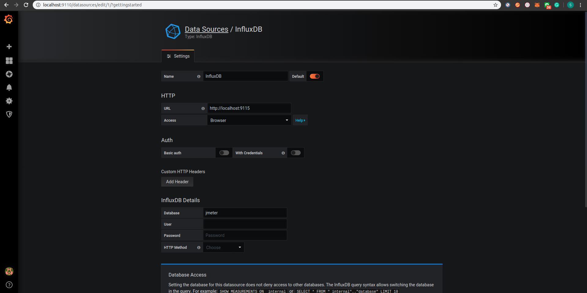
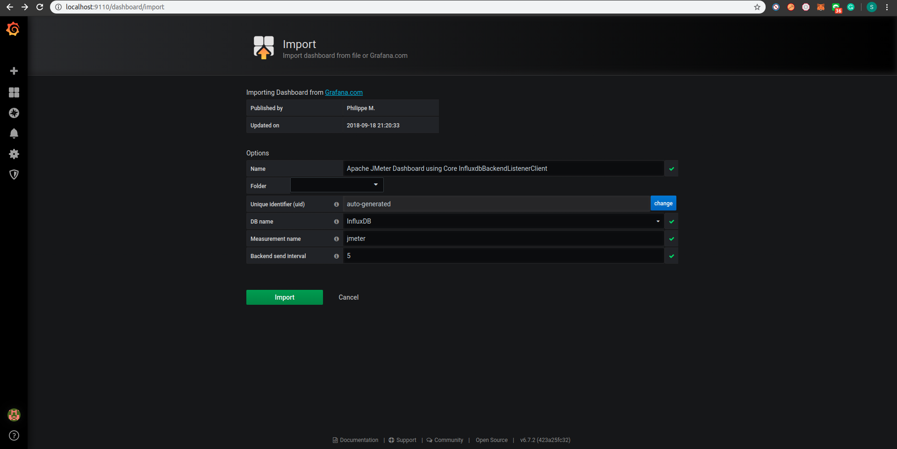

# GP

Grafana and Prometheus is another stack for monitoring.

InfluxDB is time-series database which able to handle high read and write load

## Start docker

```bash
docker-compose up -d
```

## Accessing

- [prometheus-web](http://localhost:9090)
- [grafana-web](http://localhost:9110) - with username: `admin` and password: `P@ssw0rd`

## Details

- `prometheus` is a system service monitoring. It collects matrics from configurated targets at given interval
- `node-exporter` is exporter to get machine matrics. You can select matric via dropdown `insert matric at cursor` on prometheus with select `Graph` tab display as graph
- `grafana` is graph display UI

## Linking grafana with prometheus

- Create data source: gear icon (configuration) > select prometheus > add URL as `http://learning_monitoring_prometheus:9090` > click `Save & Test` (Check that prometheus you set is a default one)
- New dashboard: select matric visualization > add query > select graph to display
- Done !!

## Load Test with result on grafana

In case of testing with jmeter. You might want the result show on grafana.

### Setting up influxdb

```bash
docker exec -it learning_monitoring_influxdb bash

root@2453056f1ff6:/# influx -precision rfc3339
Connected to http://localhost:8086 version 1.7.10
InfluxDB shell version: 1.7.10
> create database jmeter
> show databases;
name: databases
name
----
_internal
jmeter
>
```

You can find [cheat sheet](https://gist.github.com/tomazursic/6cc217e2644c619ceceefb8ce824925b) by click the link

### Setting up Jmeter

1. `./download-jmeter.sh`
2. `./start-jmeter.sh`
3. Import jmx file

   ```bash
   File > Open > Select `Golang Load Test.jmx` > Let's rock
   ```

### Setting up Grafana



Then

- New dashboard: import dashboard `5496`
  
- Click import
- Done !!
